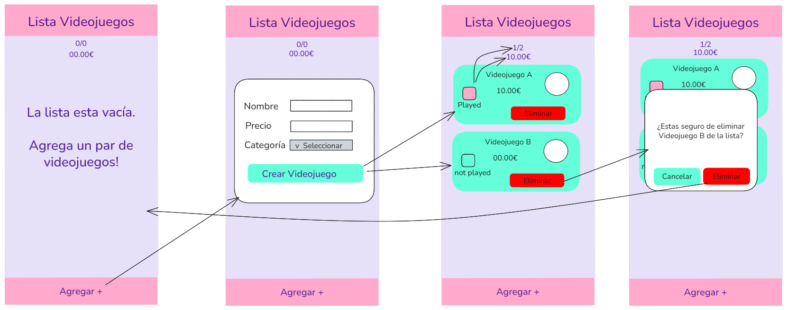
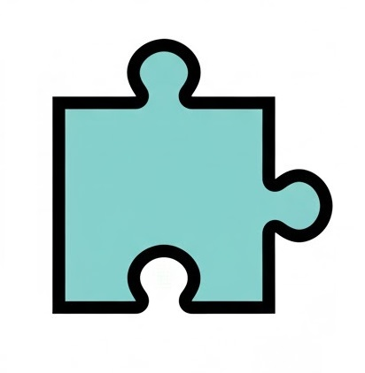
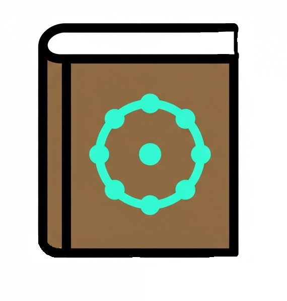
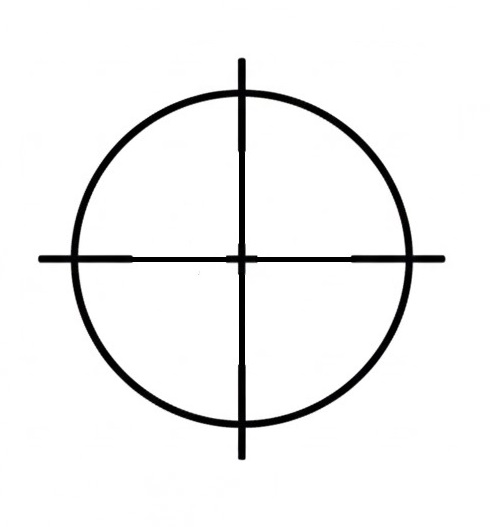
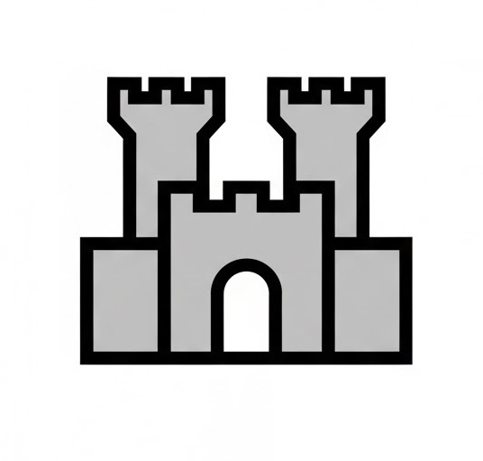
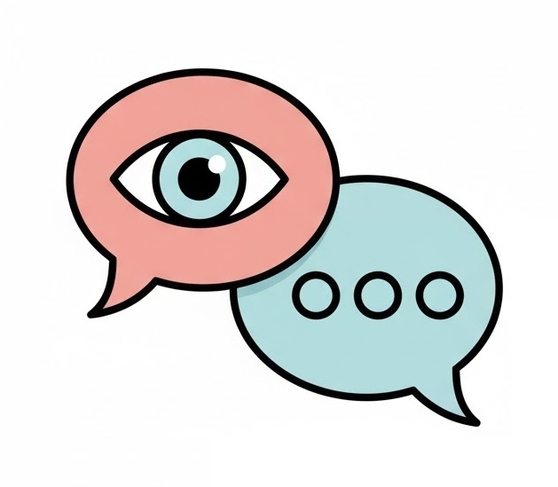

## Diseño en excalidraw
Utilizando excalidraw llegué a un diseño simple de la aplicacion pero efectivo.

## Categorías
Las categorias escogidas son 7:
|Categoría| Imagen|
|-|-|
|Plataformas||
|Puzzles||
|RPG||
|Shooter||
|Deportes||
|Estrategia||
|Novela Visual||

## Colores
Los colores escogidos para el proyecto son unos colores bastante suaves que combinen y contrasten.

| Elemento de la Interfaz | Color | Código Hexadecimal |
| --- | --- | --- |
| **Fondo Principal** | 
 | `#E6E0F8`|
| **Secundario** |  
 | `#FFAACC` | 
| **Texto / Títulos** |  
 | `#4A148C` |
| **Objetos** |  
 | `#64FFDA` |
| **Boton Eliminar** |  
 | `#FF0000` |